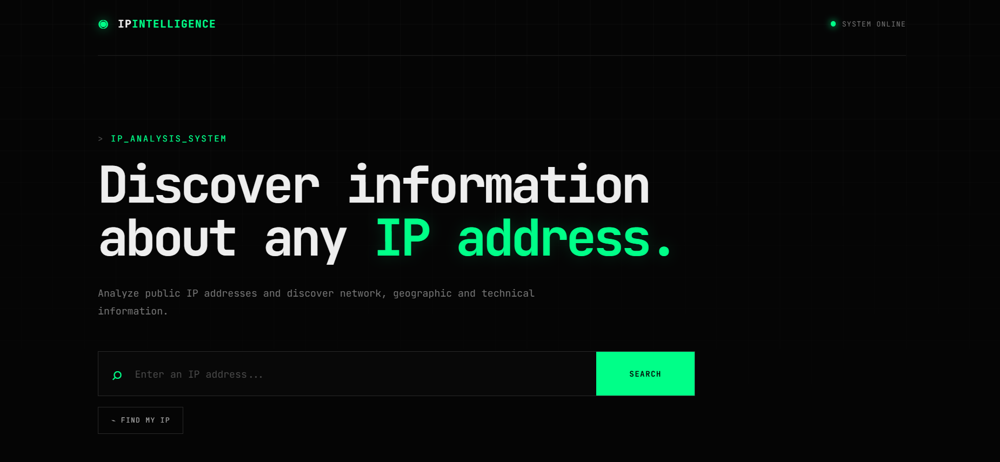

# 🟢 IP Intelligence

> Uma ferramenta web moderna para análise de endereços IP, desenvolvida com HTML, CSS e JavaScript.



---

## 🖥️ Sobre o projeto

O **IP Intelligence** é uma aplicação web criada para consultar e analisar endereços IP públicos, apresentando informações de rede, localização aproximada e dados técnicos através de uma interface moderna inspirada em sistemas de monitoramento e análise.

O projeto foi desenvolvido com foco em **design, interatividade, responsividade e integração com APIs**, utilizando apenas tecnologias web.

---

## ✨ Funcionalidades

* 🔎 Consulta de endereços IP
* 🌐 Identificação automática do próprio IP
* 📍 Localização geográfica aproximada
* 🌎 País, região e cidade
* 🏢 Provedor de internet (ISP)
* 🔢 Identificação de IPv4 e IPv6
* 🏷️ Informações de ASN
* 🕐 Fuso horário e UTC
* 📮 Código postal aproximado
* 📌 Latitude e longitude
* 🗺️ Abertura da localização no Google Maps
* 📋 Cópia dos dados da consulta
* 🕘 Histórico das pesquisas
* 💾 Armazenamento do histórico com LocalStorage
* 📱 Interface responsiva
* ⚡ Estados de carregamento e tratamento de erros

---

## 🛠️ Tecnologias utilizadas

### Front-End

* **HTML5** para estrutura da aplicação
* **CSS3** para estilização, responsividade e animações
* **JavaScript** para lógica e interatividade

### Integrações

* **Fetch API** para comunicação com a API
* **IPWho.is** para informações de endereços IP
* **Google Maps** para visualização da localização

### Armazenamento

* **LocalStorage** para salvar o histórico das consultas diretamente no navegador.

---

## 🎨 Interface

O projeto utiliza uma identidade visual baseada em uma estética **dark/cyber**, com elementos inspirados em sistemas de monitoramento e análise de dados.

```text
BACKGROUND  →  #050505
PRIMARY     →  #00FF88
CARDS       →  #0C0C0C
BORDERS     →  #1C1C1C
TEXT        →  #EEEEEE
```

O objetivo é proporcionar uma interface moderna, limpa e imersiva, mantendo a aplicação simples de utilizar.

---

## 🚀 Como executar

### 1. Clone o repositório

```bash
git clone https://github.com/larissacladeran/ip-intelligence.git
```

### 2. Entre na pasta

```bash
cd ip-intelligence
```

### 3. Execute o projeto

Abra o arquivo:

```text
index.html
```

Você também pode utilizar uma extensão como **Live Server** no Visual Studio Code para executar o projeto localmente.

---

## 🔍 Como utilizar

Digite um endereço IP no campo de pesquisa e clique em:

```text
SEARCH
```

O sistema irá consultar a API e apresentar as informações disponíveis sobre o endereço.

Também é possível utilizar:

```text
FIND MY IP
```

para identificar automaticamente o IP público utilizado na conexão.

---

## 📊 Informações analisadas

A aplicação pode apresentar informações como:

```text
IP ADDRESS
IP VERSION
LOCATION
COUNTRY
ISP
ORGANIZATION
ASN
TIMEZONE
UTC OFFSET
POSTAL CODE
LATITUDE
LONGITUDE
```

A localização aproximada também pode ser aberta diretamente no Google Maps.

---

## 🔐 Privacidade

O **IP Intelligence** utiliza informações públicas fornecidas pelo serviço de geolocalização de IP.

A localização apresentada é **aproximada** e não representa necessariamente o endereço físico exato de uma pessoa.

Um endereço IP não deve ser interpretado como uma forma de obter a localização residencial precisa de alguém.

---

## 🌐 API

Este projeto utiliza a **IPWho.is API** para obter informações relacionadas aos endereços IP.

Os dados apresentados dependem das informações disponíveis para cada endereço.

---

## 📱 Responsividade

A interface foi desenvolvida para funcionar em diferentes dispositivos:

```text
💻 Desktop
🖥️ Notebook
📱 Smartphone
📟 Tablet
```

---

## 📂 Estrutura do projeto

```text
ip-intelligence/
│
├── index.html
├── style.css
├── script.js
├── preview.png
└── README.md
```

---

## 🎯 Objetivo

Este projeto foi desenvolvido como parte do meu portfólio para praticar e demonstrar conhecimentos em:

* Desenvolvimento Front-End
* JavaScript
* Consumo de APIs
* Manipulação do DOM
* LocalStorage
* Validação de dados
* Design de interfaces
* Responsividade
* Experiência do usuário

---

## 👩‍💻 Desenvolvido por

**Larissa Calderan**

Desenvolvedora Full Stack com foco em **Front-End**, apaixonada por criar interfaces modernas, funcionais e intuitivas.

⭐ Se você gostou do projeto, deixe uma estrela no repositório!

---

## 📄 Licença

Este projeto está disponível para fins de estudo e portfólio.
